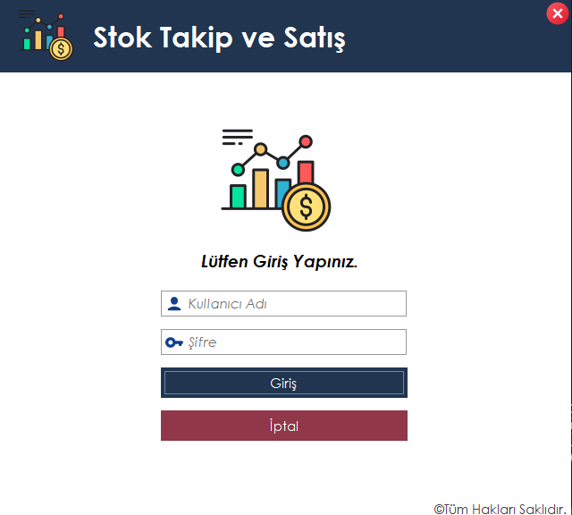
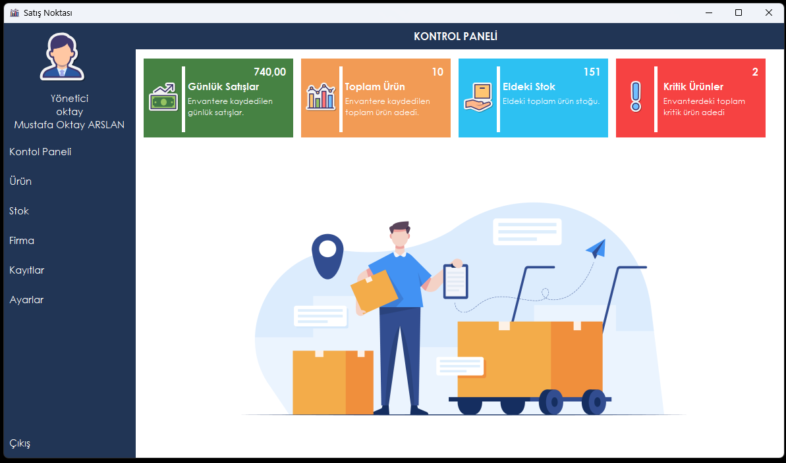
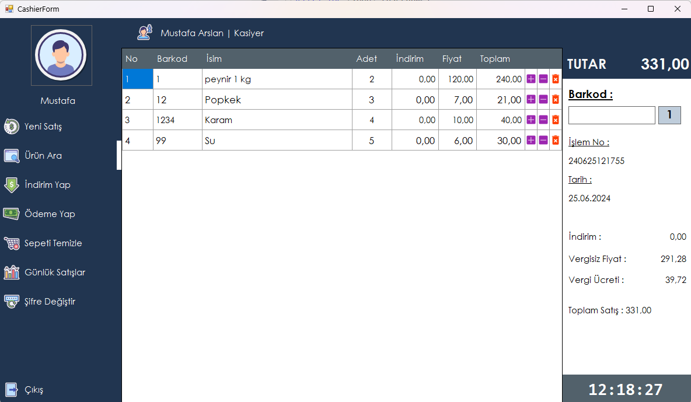

# Stok Takip ve Satış Yönetim Sistemi

Bu proje, perakende satış işletmeleri için geliştirilmiş bir stok takip ve satış yönetim sistemi yazılımıdır. C# programlama dili ve MSSQL veritabanı kullanılarak oluşturulmuştur. Sistem, kasiyer ve yönetici olmak üzere iki farklı kullanıcı rolü üzerinde çalışır ve kullanıcıların stok yönetimi, satış işlemleri, raporlama ve diğer yönetimsel görevleri kolayca yerine getirmesini sağlar.
## Proje Görüntüleri

- Uygulamanın görsellerini görmek için tıklayınız: [Uygulama Görselleri](https://github.com/mustafaoktayarslan/Stock-and-Sales-Management-System/tree/master/projectImages)

## Kullanıcı Rolleri

1. **Kasiyer:**
   - Satış işlemlerini gerçekleştirir.
   - Müşteri işlemlerini yönetir (ürün satışı, iade, indirim uygulaması).
   - Günlük kasa işlemlerini takip eder.

2. **Yönetici:**
   - Ürün stoklarını yönetir (ürün ekleme, silme, güncelleme).
   - Kasiyerleri yönetir (yetki atama, performans değerlendirmesi).
   - Satış raporlarına erişir ve analiz eder.
   - Sistem ayarlarını yapılandırır (örneğin, vergi oranları, indirim politikaları).

## Temel Özellikler

- **Ürün Yönetimi:**
  - Yeni ürün ekleme, güncelleme ve silme işlemleri.
  - Stok durumlarının anlık takibi ve güncellenmesi.

- **Satış İşlemleri:**
  - Kasiyerler tarafından yapılan satış, iade ve indirim işlemleri.
  - Satış işlemleri sonrası stok güncellemeleri otomatik olarak yapılır.

- **Kasa İşlemleri:**
  - Günlük kasa hareketleri takip edilir ve raporlanır.

- **Raporlama ve Analiz:**
  - RDLC raporları ile günlük, haftalık ve aylık satış raporları alınabilir.
  - Ürün bazında satış istatistikleri ve kârlılık analizleri sunulur.

- **Kullanıcı Yönetimi:**
  - Kasiyer ve yönetici rollerinin yönetimi ve yetkilendirilmesi.

- **Sistem Ayarları:**
  - Vergi oranları, indirim politikaları gibi sistem parametrelerinin yönetimi.

## Geliştirme Süreci

1. **Analiz ve Tasarım:** Kullanıcı ihtiyaçları belirlenir, veri modeli ve kullanıcı arayüzü tasarlanır.
2. **Geliştirme:** C# programlama dili kullanılarak işlevsellikler geliştirilir, MSSQL ile veritabanı entegrasyonu sağlanır.
3. **Raporlama:** RDLC raporları tasarlanarak entegre edilir.
4. **Test ve Doğrulama:** Yazılımın test edilmesi, hataların giderilmesi ve kullanılabilirlik kontrolü yapılır.

## Kullanım

1. **Gereksinimler:**
   - Visual Studio IDE
   - MSSQL Server
   - RDLC Report Designer

2. **Kurulum:**
   - Proje dosyalarını indirin veya klonlayın.
   - Visual Studio'da projeyi açın.
   - MSSQL Server üzerinde veritabanını oluşturun veya bağlantı ayarlarını düzenleyin.
   - Projeyi derleyip çalıştırın.
   - DatabaseScript içerisindeki MarketDB.sql script şemasını SQL serverda açarak oluşturun. [Scriptin Linki](https://github.com/mustafaoktayarslan/Stock-and-Sales-Management-System/blob/master/DatabaseScript/MarketDB.sql)

3. **Kullanım Kılavuzu:**
   - Uygulamayı başlatın.
   - Kullanıcı girişi yaparak kasiyer veya yönetici olarak sisteme erişin.(Default giriş: Kullanıcı adı: admin Şifre: admin)
   - Sistem üzerindeki işlevsellikleri kullanarak stok takibi yapın, satış işlemleri gerçekleştirin
